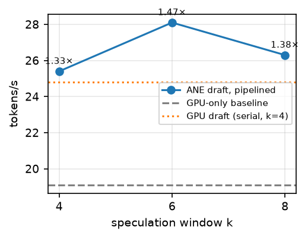
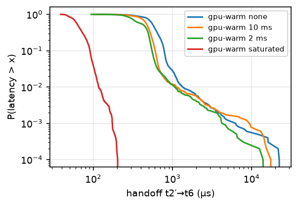

# ZeroHop

**Speculative decoding across the Apple Neural Engine and GPU — on one consumer chip, via public APIs only.**

A 1B draft model runs on the ANE (Core ML), an 8B target verifies on the GPU (MLX/Metal), and a measurement harness characterizes the seam between them. Apple M3 · 16 GB · macOS 26.5.1 · July 2026.

## Results

| configuration (Llama-3.1-8B-4bit target, greedy) | tok/s | speedup |
|---|---|---|
| GPU-only baseline (MLX) | 19.1 | 1.00× |
| + speculative draft on the **same GPU** (serial, k=4) | 24.8 | 1.28× |
| + speculative draft on the **ANE** (serial, k=4) | 18.2 | 0.95× |
| + ANE draft, **pipelined** (k=4) | 26.4 | 1.28× |
| + ANE draft, pipelined, fused head (**k=6**) | **28.1** | **1.47×** |

- **The ANE draft is fully hidden inside the GPU's verify window**: overlap-span p50 = 150.465 ms vs verify p50 = 150.463 ms — a 2 µs difference, holding across the whole k-sweep (up to 9 ANE calls per batch). Drafting costs the GPU nothing.
- **Output is token-exact** with the baseline in every greedy cell; the sampling mode (Leviathan rejection acceptance) is distribution-exact by construction.
- **The ANE→GPU handoff is p99 165 µs** (10,000-iteration protocol) once two undocumented power-state effects are controlled — three orders of magnitude below the compute terms.
- The measured viability arithmetic, all constants from this hardware:
  `T_draft(k=4) = 95.6 ms + T_handoff(p99) = 0.15 ms < T_verify = 144.4 ms` (34% margin).



### Boundary conditions

- Against a **fast 3B target speculation loses everywhere** (same-GPU 0.58×, ANE serial 0.45×) — the win regime is the memory-bound large-target regime the theory predicts.
- **k has a knee at 6**: at k=8, acceptance decay (78% → 73%) and verify-window growth outpace tokens/round.
- **Sampling halves acceptance** (T=0.8: 44.6% ANE / 29.9% GPU draft) and serial speculation goes unprofitable — the known temperature sensitivity of speculation. The fp16-activation ANE draft agrees with the target's distribution notably better than the end-to-end 4-bit GPU draft in both regimes.

## Harness findings

The project ran measurement-first: a synchronization harness with an explicit kill criterion (p99 handoff > 2 ms ⇒ stop) ran before any model existed. Everything is reported as p50/p95/p99/p99.9 over ≥10,000 iterations per cell — **means are never a success criterion**. Highlights:

- **The dominant tail effect is an undocumented GPU idle-ramp** — not ANE cold-start. Uncontrolled: p99 1.33 ms, p99.9 6.29 ms, max 22.9 ms on the event-signal→kernel-start segment. A saturated GPU collapses it to p99 165 µs; trickle keep-warm does *not* remove the deep tail; the surviving ~1-in-10k events are run-to-run ambient (OS preemption, not power state — established by a repeat run).
- **The ANE warmth axis is flat** at a 20 Hz dispatch duty cycle: the workload's own traffic is heartbeat enough. (A 1k-iteration run had shown a "cold event" that vanished at 10k — one of two conclusions the full protocol reversed.)
- **Both zero-copy ANE→GPU transport paths are real** (IOSurface→`MTLTexture`, and page-aligned `makeBuffer(bytesNoCopy:)`), verified by per-iteration backing-identity asserts; statistically indistinguishable at 10k. A coherency canary — computed by the ANE's own matmul, validated by the GPU kernel before reading the payload — has **zero stale reads in 26,000+ iterations**.
- **Public-API dispatch overhead**: a minimal ANE dispatch round trip costs ~300 µs p50 through release-build Core ML vs the ~95 µs private-path figure from maderix's benchmarking (this bounds the overhead; it doesn't isolate it). Core ML's cost model **refuses per-token-scale ANE dispatches** (multi-token drafting is required, not just faster), and the ANE compiler rejects **compiled weights above ~1 GB** (2.3 GB fp16 → wholesale CPU; 591 MB 4-bit palettized → `preferred=ane`).
- 

## The ANE deployment recipe

Getting a real stateful-KV-cache Llama-3.2-1B onto the ANE through public API hit four walls; each was isolated with a discriminating experiment ([`Tools/convert_draft.py`](Tools/convert_draft.py) is the recipe as executable code):

| # | wall | fix |
|---|---|---|
| 1 | entire program `supported=[cpu]` | **fixed-window attention** — any tensor-valued slice bound makes the graph dynamic and the ANE compiler rejects *everything* |
| 2 | states suspected | toy-model experiment: `MLState` is ANE-eligible — not the poison |
| 3 | still all-CPU at fp16 | **≤1 GB compiled-weight ceiling** → 4/6-bit LUT palettization |
| 4 | acceptance collapsed to 11% | `torch.jit.trace` **bakes slice bounds to constants** — every KV write hit cache slot 0; fix = **one-hot blend write** `cache·(1−w)+onehot(pos)ᵀ·kv` |

Wall 4 was invisible to output correctness (the target corrects every wrong draft — only the acceptance rate betrayed it); a torch-vs-Core ML greedy A/B is now a mandatory draft-health assertion. A side effect of the fix: speculation rollback is **O(1)** — move the position pointer, re-mask, no cache surgery.

## Landscape (July 2026)

No published work I could find holds all four of: **(1)** two-model speculation, **(2)** ANE-draft + GPU-verify on one consumer chip, **(3)** public API only, **(4)** rigorous handoff characterization. Every neighbor holds at most two:

| project | API | engines | speculation | handoff measured? |
|---|---|---|---|---|
| [Mirror-SD](https://arxiv.org/abs/2510.13161) (Apple, Dec 2025) | unspecified (server-scale) | GPU + NPU, cross-device | ✔ two-model | not on consumer hardware |
| [ANEForge](https://github.com/sbryngelson/ANEForge) (Jun 2026) | private `aned` stack | ANE only | ✔ two-model exact (2.28×) | ✗ |
| [ane.cpp](https://github.com/skyfallsin/ane.cpp) | private `_ANEClient` | ANE only | self-speculative — *slower than plain decode* | ✗ |
| [SqueezeBits "Yetter"](https://blog.squeezebits.com/disaggregated-inference-on-apple-silicon-npu-prefill-and-gpu-decode-67176) (Aug 2025) | public Core ML + MLX | ANE prefill + GPU decode (iPhone) | ✗ (disaggregation) | ✗ |
| [maderix/ANE](https://github.com/maderix) | private `_ANEClient` | GPU↔ANE demos (IOSurface zero-copy) | ✗ | demo-level |
| [CoreML-LLM](https://github.com/john-rocky/CoreML-LLM) | public Core ML | ANE only | ✗ | ✗ |
| [Orion](https://arxiv.org/abs/2603.06728) | private | ANE characterization | ✗ | dispatch-level |
| [DuoDecoding](https://arxiv.org/abs/2503.00784) / [Dovetail](https://arxiv.org/abs/2412.18934) | CUDA-class PCs | CPU draft + GPU target | ✔ two-model | different platform |
| **ZeroHop** | **public Core ML + Metal** | **ANE draft + GPU verify, one chip** | **✔ two-model exact** | **✔ per-stage, 10k protocol** |

Notes:

- **[Mirror-SD](https://arxiv.org/abs/2510.13161) is the concept prior art**: Apple's own research maps speculation across heterogeneous accelerators (GPU + NPU) at server scale (2.8–5.8×, 14B–66B) — but names no consumer device, imposes no public-API constraint, and characterizes no handoff. ZeroHop is a consumer-silicon, public-API implementation of that design class, with the handoff measured.
- **The gap is probably not oversight.** Prior ANE work (maderix, Orion, ane.cpp, ANEForge) uses private APIs, citing Core ML's scheduler overhead. This project measures what the public path — the only one App Store software can ship — actually costs.
- **Attribution correction**: the widely-quoted ~0.095 ms ANE dispatch figure originates from maderix's private-API benchmarking (credited by Orion) — it is not an Orion measurement.

On a single engine: ane.cpp's *self*-speculation on the ANE is slower than plain decoding (draft and verify serialize on one engine — the same contention as the same-GPU control above); ANEForge's two-model speculation on the ANE alone reaches 2.28×. ZeroHop runs the draft on an engine that is otherwise idle.

## Repository map

| artifact | what it is |
|---|---|
| [`Sources/HarnessCore`](Sources/HarnessCore) | measurement primitives: exact-percentile recorders (zero-alloc loops), CPU/GPU clock fusion, real-time thread policies, thermal gating, raw CSV/JSON export |
| [`Sources/HarnessM0–M2`](Sources/) | the handoff harness: noise floor, shared-event round trip, zero-copy transport A/B, coherency canary, memory-pressure cells |
| [`Sources/HarnessM3`](Sources/HarnessM3) | the end-to-end system: Core ML/ANE draft with O(1) rollback, MLX target lane, pipelined decoder, rejection sampling |
| [`Tools/convert_draft.py`](Tools/convert_draft.py) | the ANE deployment recipe, executable |
| [`Tools/plot_results.py`](Tools/plot_results.py) | regenerates every figure from `Results/` raw data |
| [`FINDINGS.md`](FINDINGS.md) | the full lab notebook, chronological — including the superseded claims and their revisions |
| [`PLAN.md`](PLAN.md) | the implementation plan + SDK audit (responds to a project spec not included in the repo) |

The measurement binary (`zerohop`) has zero third-party dependencies; MLX is confined to the separate end-to-end runner (`zerohop-m3`).

## Reproducing

Requirements: Apple Silicon Mac (macOS 15+; developed on M3/26.5.1), Xcode command-line tools, Python 3.12 for model conversion only.

```sh
swift build -c release                          # measurement harness (no deps)
python3.12 -m venv Tools/.venv && Tools/.venv/bin/pip install coremltools numpy matplotlib
Tools/.venv/bin/python Tools/make_models.py Models
xcrun coremlcompiler compile Models/m1_tiny.mlpackage Models/

.build/release/zerohop m0                                                     # noise floor
.build/release/zerohop m1 --e3 sync --e4 rt --e5 none --gpu-warm saturated    # handoff
.build/release/zerohop m2 --e1 A --gpu-warm saturated                         # transport + canary

# end-to-end (downloads models; xcodebuild required — SwiftPM can't compile MLX's Metal shaders)
Tools/.venv/bin/pip install "torch==2.7.0" "transformers==4.53.3"
Tools/.venv/bin/python Tools/convert_draft.py Models --nbits 4
xcrun coremlcompiler compile Models/draft_llama32_1b.mlpackage Models/
xcodebuild build -scheme zerohop-m3 -configuration Release -destination 'platform=macOS' \
  -derivedDataPath .build/xcode -skipPackagePluginValidation
.build/xcode/Build/Products/Release/zerohop-m3 --k 6 --n 200 \
  --target mlx-community/Meta-Llama-3.1-8B-Instruct-4bit \
  --coreml-draft Models/draft_llama32_1b.mlmodelc --overlap on
```

Protocol: ≥500 warmup + ≥10,000 measured iterations per cell, **release builds only** (debug builds inflate the dispatch segment ~3×), plugged in, thermal-gated. Every run exports `meta.json` (chip, OS build, power source, thermal timeline) + per-iteration `samples.csv` to `Results/`.

## Limitations

One chip (findings are expected to vary by ANE generation — raw data ships for replication); greedy is the optimized regime; the ANE draft is per-call latency-bound (~14–20 ms/token; a trained [Medusa](https://arxiv.org/abs/2401.10774)-class multi-token head would cut this, and its gains convert to speculation-window headroom rather than device contention); energy unmeasured (`powermetrics` needs root); the public-vs-private tax number bounds rather than isolates.

## References

- Leviathan, Kalman, Matias. *Fast Inference from Transformers via Speculative Decoding.* ICML 2023. [arXiv:2211.17192](https://arxiv.org/abs/2211.17192)
- Chen et al. *Accelerating LLM Decoding with Speculative Sampling.* [arXiv:2302.01318](https://arxiv.org/abs/2302.01318)
- Apple ML Research. *Mirror Speculative Decoding: Breaking the Serial Barrier in LLM Inference.* [arXiv:2510.13161](https://arxiv.org/abs/2510.13161)
- *Orion: Characterizing and Programming Apple's Neural Engine for LLM Training and Inference.* [arXiv:2603.06728](https://arxiv.org/abs/2603.06728)
- Cai et al. *Medusa.* [arXiv:2401.10774](https://arxiv.org/abs/2401.10774) · Miao et al. *SpecInfer.* [arXiv:2305.09781](https://arxiv.org/abs/2305.09781)
- Lu et al. *DuoDecoding.* [arXiv:2503.00784](https://arxiv.org/abs/2503.00784) · *Dovetail.* [arXiv:2412.18934](https://arxiv.org/abs/2412.18934)
- Apple ML Research. *Recurrent Drafter (ReDrafter).* [arXiv:2403.09919](https://arxiv.org/abs/2403.09919)
- [ANEForge](https://github.com/sbryngelson/ANEForge) · [ane.cpp](https://github.com/skyfallsin/ane.cpp) · [ANEMLL](https://github.com/Anemll/Anemll) · [CoreML-LLM](https://github.com/john-rocky/CoreML-LLM) · [MLX](https://github.com/ml-explore/mlx) / [mlx-swift-lm](https://github.com/ml-explore/mlx-swift-lm)
- SqueezeBits. *Disaggregated Inference on Apple Silicon: NPU Prefill and GPU Decode.* [blog](https://blog.squeezebits.com/disaggregated-inference-on-apple-silicon-npu-prefill-and-gpu-decode-67176)
- vllm-mlx [arXiv:2601.19139](https://arxiv.org/abs/2601.19139) · Apple-Silicon runtime comparison [arXiv:2511.05502](https://arxiv.org/abs/2511.05502)

*Landscape statements are as of July 2026.*
